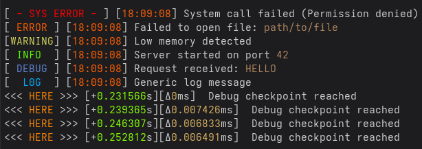

# Log — Standalone C++ Logging Class

A lightweight, standalone logging system for C++ projects.

Designed for:
- minimal dependencies
- compile-time log stripping
- configurable log levels
- optional timestamping
- file + terminal output
- single tread programs

---



## Features

- Singleton logger
- Compile-time log filtering (zero runtime cost when disabled)
- Multiple log levels
- Separate file and terminal configuration
- Timestamp support:
  - absolute time
  - time since start
  - delta between logs
- Color support (terminal only)
- Automatic log file creation with timestamped filename

---

## Installation

Copy the `Log` folder into your project:

Include the logger:

```cpp
#include "Log.hpp"
```

---

## Basic Usage

```cpp
Log& logger = Log::instance();

if (!logger.getStatus()) {
    std::cerr << "Log failed to setup" << std::endl;
    return FAILURE;
}
```

---

## Logging Macros

Use macros for logging:

```cpp
LOG_ERROR_SYS("System call failed")
LOG_ERROR("Something failed")
LOG_WARNING("Careful: " << value)
LOG_INFO("Server started")
LOG_DEBUG("Debug value: " << x)
LOG_LOG("Generic log message")
```

Special debug location:

```cpp
LOG_HERE("Reached checkpoint")
```

---

## Configuration

All configuration is done via `DefineLevels.hpp`.

---

### Enable / Disable Levels

```cpp
#define LOG_LEVEL   (LVL_ERROR | LVL_DEBUG)
#define PRINT_LEVEL (LVL_ERROR | LVL_WARNING | LVL_INFO)
```

- LOG_LEVEL → written to file
- PRINT_LEVEL → printed to terminal

---

### Available Levels

```cpp
LVL_ERROR_SYSTEM
LVL_ERROR
LVL_WARNING
LVL_INFO
LVL_DEBUG
LVL_LOG
```

---

### Time Modes

Timestamps can be added to the logs:
- Absolute current time `T_ABS`
- Time Relative to the start of the program `T_SINCE`
- Specific to `LOG_HERE()`, time relative the last `LOG_HERE()` call `T_DELTA`


---

### Globally add / remove a Time Output

```cpp
#define PRINT_TIME_MODE (T_ABS | T_SINCE | T_DELTA)
#define LOG_TIME_MODE   (T_ABS | T_SINCE)
```

---

### Filter Time Per Level

```cpp
#define PRINT_TIME_FILTER (LVL_INFO | LVL_DEBUG | LVL_LOG)
#define LOG_TIME_FILTER   (LVL_ERROR | LVL_WARNING | LVL_INFO | LVL_DEBUG)
```

---

### LOG_HERE Timing

```cpp
#define LOG_HERE_TIME_FILTER (T_SINCE | T_DELTA)
```

---

## Compile-Time Stripping

Logs are removed at compile time when disabled:

```cpp
#if LOG_LEVEL & LVL_DEBUG
    LOG_DEBUG("Will compile");
#endif
```

If a level is disabled:
- no code is generated
- no runtime cost

Meaning you can leave logs everywhere in your code without worries of bloating the binary

---

## Log Output

Logs are stored in:

```cpp
#define LOG_PATH "log/"
```

Files are automatically named:

```
log_YYYYMMDD_HHMMSS.log
```

---

## Notes

- Not thread-safe (currently)
- Uses POSIX functions (`write`, `gettimeofday`)
- c++11 compatibility
- Intended for Unix-like systems (Linux/macOS)

---

## Future Improvements

- Thread safety (mutex or lock-free design)
- Per-level delta tracking
- Async logging
- Performance optimizations (reduce string stream usage)
- For a quick preview, clone the project, then execute:
```bash
make
```